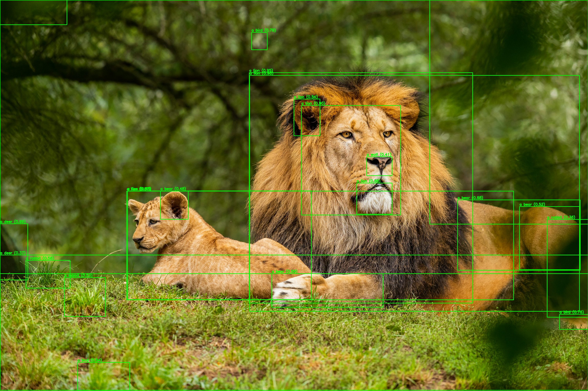

# Wildlife Detector in Videos and Images

A deep learning pipeline for detecting, segmenting, and classifying animals in both images and videos. It uses Meta AI's **SAM (Segment Anything Model)** for segmentation and **OpenCLIP** for zero-shot classification. The final output includes annotated images or videos, along with CSV logs of detections and real-time animal counts in videos.

---

## 🧠 Model Overview

- **SAM (Segment Anything Model)** is used to generate segmentation masks:
  - `sam_vit_h_4b8939.pth`: for image-based segmentation (not uploaded to GitHub).
  - `sam_vit_b.pth`: for real-time video segmentation.
- **OpenCLIP** is used to classify each segmented region based on cosine similarity between image and text embeddings.

---

## 📁 Project Structure

```
.
├── data/                      # 10 sample images for testing
│
├── models/                   # Pretrained SAM models
│   ├── sam_vit_b.pth         # Used in video processing
│   └── sam_vit_h_4b8939.pth  # Used in image segmentation (not included in repo)
│
├── outputs/                  # Image segmentation results from segment.py
├── outputs_classified/      # Image classification results from classify.py
├── outputs_classifiedv2/    # Refined image classification results from classifyv2.py
├── segments/                # Segmentation masks for classifyv2.py
│
├── log.csv                  # Log from classifyv2.py
├── video_log.csv            # Log from classify_video.py
│
├── input_video.mp4          # Original test video
├── input_videov1.mp4        # Additional video sample
├── input_videov2.mp4
├── input_videov3.mp4
├── input_videov5.mp4
│
├── video_log.csv         # Frame-by-frame detection logs.
├── video_logv2.csv
├── video_logv3.csv
├── video_logv5.csv
│
├── output_video.mp4         # Output with detection overlays
├── output_videov1.mp4
├── output_videov2.mp4
├── output_videov3.mp4
├── output_videov5.mp4
│
├── segment.py               # Segments animals in images using SAM
├── classify.py              # Classifies animals in images using OpenCLIP
├── classifyv2.py            # Filters by confidence + segments + classifies
├── classify_video.py        # Full pipeline on video (SAM + OpenCLIP + CSV)
│
├── wildlifemainv0.ipynb     # Colab version (input_video.mp4 -> output_video.mp4)
├── wildlifemainv1.ipynb     # Colab version for v1
├── wildlifemainv2.ipynb     # Colab version for v2
├── wildlifemainv3.ipynb     # Colab version for v3
├── wildlifemainv5.ipynb     # Colab version for v4 (Shows the latest version and current animal count.)
```

---

## 🛠️ Features

✅ Segment animals in static images using SAM  
✅ Classify segments using OpenCLIP (zero-shot)  
✅ Detect animals in videos frame-by-frame  
✅ Filter predictions by confidence threshold (≥ 75%)  
✅ Count animals in each video frame  
✅ Log results to CSV (per frame, with coordinates and confidence)  
✅ Output annotated videos with bounding boxes and labels

---

## 🧪 Project Workflow

### 1. **Image-based Segmentation & Classification**
- Run `segment.py` to segment 10 test images in `data/`
- Then run `classify.py` or `classifyv2.py` to classify each segment using OpenCLIP
- Outputs are saved in:
  - `outputs/`
  - `outputs_classified/`
  - `outputs_classifiedv2/`

### 2. **Video-based Detection**
- Run `classify_video.py` to apply SAM + OpenCLIP on videos like `input_video.mp4`
- Frame-by-frame detection with real-time animal counting
- Output is saved as:
  - Annotated video: `output_video.mp4`
  - Log CSV: `video_log.csv`

---

## 📦 Requirements

Install dependencies:

```bash
pip install torch torchvision
pip install opencv-python
pip install git+https://github.com/facebookresearch/segment-anything.git
pip install git+https://github.com/mlfoundations/open_clip.git
```

> 💡 Recommended: Use Google Colab for running notebooks `wildlifemainv*.ipynb` with GPU.

---

## 🧠 Model Weights

| Model File              | Description                    | Download Link |
|-------------------------|--------------------------------|----------------|
| `sam_vit_h_4b8939.pth`  | Used in `segment.py` (image)   | [Download via Meta](https://dl.fbaipublicfiles.com/segment_anything/sam_vit_h_4b8939.pth) |
| `sam_vit_b.pth`         | Used in `classify_video.py`    | Included in `models/` folder |

---

## 📊 Sample Output



---

## 📈 Example Log (CSV)

```
frame_id,label,confidence,x,y,w,h
1,a deer,0.87,143,202,75,90
1,a fox,0.91,320,210,65,80
...
```

---

## 🧪 Future Work

- Add YOLO-based fallback for faster classification
- Integrate tracking (SORT/DeepSORT) for tracking animals across frames
- Improve filtering on segmentation masks

---

## 🐾 Author

Developed by Göktan İren as a computer vision project for multi-animal detection in the wild.

---

## 📄 License

MIT License
